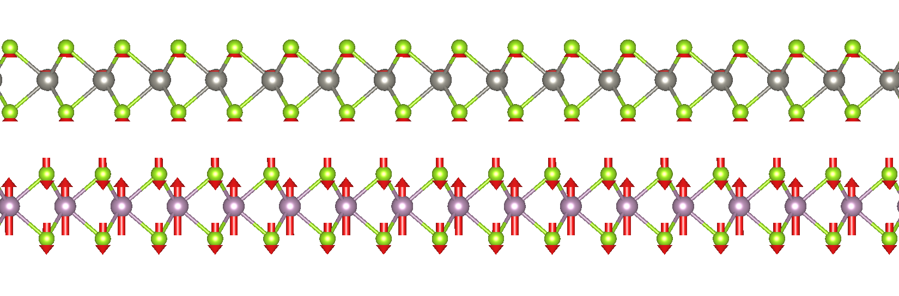

# VaspVib2XSF

A help python script to visualize the vibration modes from a `VASP` calculation.
The script read the eigenvectors of the vibration modes from `OUTCAR` and the
atomic coordinates from `POSCAR`. The vibration mode is then shown as a vector
field on the atomic sites. To visualize the mode, an '.xsf' file of the selected
mode is written, which can be openned by `VESTA`.



## Prerequisites

* [numpy](https://wiki.fysik.dtu.dk/ase/ase/io/io.html)
* [ase](https://wiki.fysik.dtu.dk/ase/ase/io/io.html)

## Usage

By default, all the vibration modes are selected (`-m 0`).

```python
usage: vasp2xsf.py [-h] [-i OUTCAR] [-p POSCAR] [-m MODE] [-s SCALE]

optional arguments:
  -h, --help  show this help message and exit
  -i OUTCAR   Location of VASP OUTCAR.
  -p POSCAR   Location of VASP POSCAR.
  -m MODE     Select the vibration mode, 0 for all modes.
  -s SCALE    Scale factor of the vector field.
```

