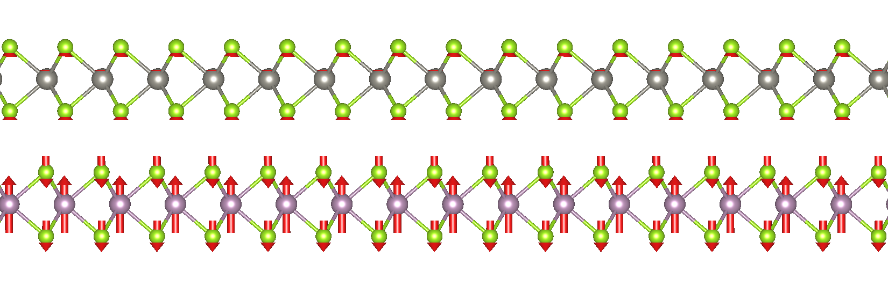

# VaspVib2XSF

A help python script to visualize the vibration modes from a `VASP` calculation.
The script read the eigenvectors of the vibration modes from `OUTCAR` and the
atomic coordinates from `POSCAR`. The vibration mode is then shown as a vector
field on the atomic sites. To visualize the mode, an '.xsf' file of the selected
mode is written, which can be openned by `VESTA`.



## Prerequisites

* [numpy](https://wiki.fysik.dtu.dk/ase/ase/io/io.html)
* [ase](https://wiki.fysik.dtu.dk/ase/ase/io/io.html)

## Usage

By default, all the vibration modes are selected. `-m` selects one mode and
**starts from 0**, the same convention as `phonon_traj.py`. The output file is
named after the 1-based mode number printed by `VASP`, so `-m 0` writes
`mode_0001.xsf`.

```python
usage: vasp2xsf.py [-h] [-i OUTCAR] [-p POSCAR] [-m MODE] [-s SCALE] [--no-cache]

optional arguments:
  -h, --help  show this help message and exit
  -i OUTCAR   Location of VASP OUTCAR.
  -p POSCAR   Location of VASP POSCAR.
  -m MODE     Select the vibration mode, STARTING FROM 0. Default: all modes.
  -s SCALE    Scale factor of the vector field.
  --no-cache  Do not read or write MODES.npz.
```

Imaginary modes are kept by default in every script, so a mode index always
matches its position in the `OUTCAR` listing.

## Other scripts

* `phonon_traj.py` generates frozen-phonon displacements and animations along a
  selected mode. Note that the amplitude is scaled by `sqrt(Natoms)` by
  default; pass `--no-scale` for localized modes. See the comment in the source.
* `vib_proj.py` projects an NVE molecular-dynamics `XDATCAR` onto the normal
  modes and plots the energy carried by each mode.
* `vaspvib.py` holds the shared `OUTCAR` parser used by all three, plus
  `participation_ratio()` / `inverse_participation_ratio()`. The participation
  ratio is roughly "how many atoms take part in this mode": it equals the
  number of atoms for a fully delocalized mode and 1 for a mode confined to a
  single atom. `vasp2xsf.py` prints it for every mode, and `phonon_traj.py`
  uses it to warn when the `sqrt(Natoms)` scaling is being applied to a
  localized mode.

